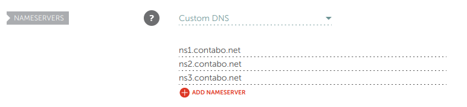
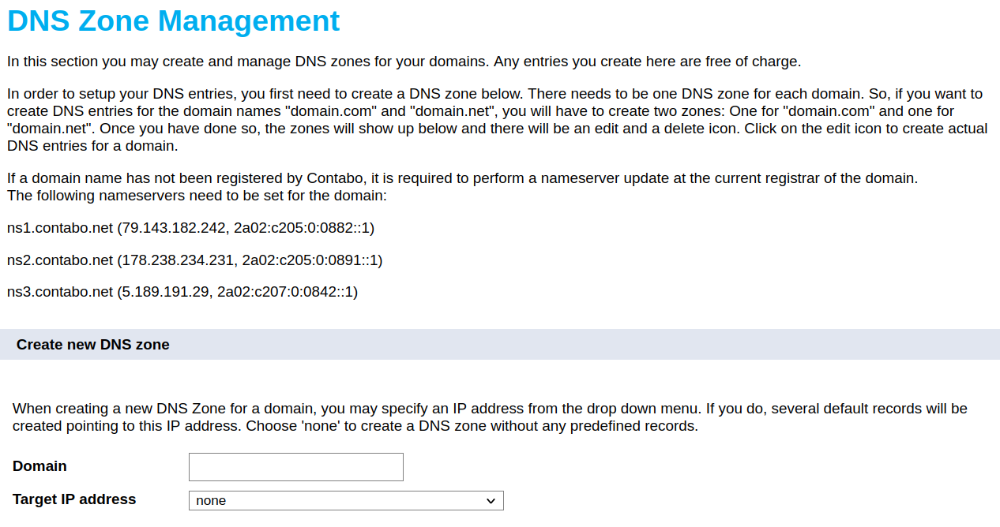

Setting up a server and deploying Pelican
##########################################
:date: 2022-03-01 17:20
:category: webdev, self-sovereignty
:tags: webdev, self-sovereignty, Linux, Pelican, Python, VIPs
:summary: Notes about setting up a server with Pelican and deploying a static website to it

.. THIS IS JUST A CONVENTION, ANY (from a list of) SYMBOL CAN BE USED AS LONG AS YOU ARE CONSISTENT !!!
.. # with overline, for parts
.. = with overline, for chapters
.. -, for sections
.. ~, for subsections
.. ", for subsubsections
.. ^, for paragraphs

.. chapter 1
.. ===========
.. section 1.1
.. ------------
.. subsection 1.1.1
.. ~~~~~~~~~~~~~~~~~
.. subsubsection 1.1.1.a
.. """"""""""""""""""""""
.. paragraph
.. ^^^^^^^^^^^^^^^^^^^^^^
.. section 1.2
.. ------------
.. chapter 2
.. ==========

.. try this is the same as above
.. chapter 1
.. ===========
.. section 1.1
.. ++++++++++++
.. subsection 1.1.1
.. -----------------
.. subsubsection 1.1.1.a
.. ~~~~~~~~~~~~~~~~~~~~~~
.. paragraph
.. ^^^^^^^^^^^^^^^^^^^^^^
.. section 1.2
.. +++++++++++++
.. chapter 2
.. ==========

.. Try this ... and it should be same as above !
.. chapter 1
.. ************
.. section 1.1
.. ===========
.. subsection 1.1.1
.. -----------------
.. subsubsection 1.1.1.a
.. ^^^^^^^^^^^^^^^^^^^^^^
.. paragraph
.. """"""""""
.. section 1.2
.. ===========
.. chapter 2
.. ************

.. THIS DOES NOT WORK!
.. chapter 1
.. ###########
.. section 1.1
.. ------------
.. subsection 1.1.1
.. ~~~~~~~~~~~~~~~~~
.. subsubsection 1.1.1.a
.. """"""""""""""""""""""
.. paragraph
.. ^^^^^^^^^^^^^^^^^^^^^^
.. section 1.2
.. ------------
.. chapter 2
.. ###########

Intro
======

This article provides some background info and tries to serve as a quick guide on the
steps required to set up a server and *deploy* it (fancy word for upload the webpage to
the server). I hope can help someone (or even my future me)

First thing to consider is what kind of website you want to create, what the state of
*dev-ops* skills (as they call it now) are, and what is the willingness/time you want to
dedicate to learn and maintain the infrastructure that comes along with the actual content
of your website. This article is focused on someone who just wants to create a static blog
(ie. no marketplace or social site that needs of *dynamic* content), and has some Linux
and programming experience.

My choice for the static site generator has been `Pelican
<https://github.com/getpelican/pelican/>`_ , which is based on python. I also did some
research on the possibility of using a CMS like Wagtail (built on Django) but drop the
idea after few hours wasted on trying to set up a database, *nginx*, *gunicorn* (and some
other fancy infrastructure I have no idea about) at the server side. 

As a **self-sovereignty** enthusiast myself, I've chosen to go this (harder than strictly
required) way. However, if you just want to get your message across as quickly as
possible, you can for sure look into something easier like `medium
<https://www.medium.com/>`_, or setting up a WordPress site. If instead you want to walk
in the path of the self-sovereign individual, own your data and train your webdev Linux
skills, then you may want to read this article. With no more introduction, let's dive
right into it.

Initial Setup
=============

This is a very condensed view of what you will need in order to get the blog up and
running:

1. Domain name
2. Hosting solution
3. Install required infrastructure on server
4. Work on your content
5. Deploy content to server

For the hosting and server there is a vast of options to chose from. I am not an expert on
this area, but after a bit of *market research* in Reddit I think these are reasonably
good options for someone based in Europe

Domain name and hosting solution
---------------------------------

I used Namecheap as the domain name registrar. You might as well go with a free domain
name solution if you prefer

.. note:: No need to purchase ssl certificate from the domain provider. We will use a free
   one

Regarding the hosting solution, I decided on a VPS (Virtual private server) and not on
a dedicated one, as I do not have the speed/load/bandwidth requirements (unless this blog
really picks up!) that would justify the need for it. And so far I have no complains:
installing stuff, logging in, displaying the page, etc. seems good enough for the price
I paid (4.99 euros/month with German hosting Contabo)

"Linking" domain and hosting
~~~~~~~~~~~~~~~~~~~~~~~~~~~~~~

You need to setup your domain provider with the custom DNS that you will find on your
hosting provider. In my case, I added these DNS into Namecheap's config

.. 

Equivalently, you will need to tell the hosting provider what your domain name is. I do
this by creating a new DNS zone in my Contabo settings.

.. .. image:: ../content/images/namecheap_setup.png
..    :height: 100 %
..    :width: 100 %
..    :scale: 10 cm
..    :alt: alternate text
..    :align: right

Server side installation and configuration
===========================================

After purchasing the VPS, you can choose what OS you want to install (you can change this
later as well). I chose Fedora Linux as that's the OS I am familiar with. You are then
sent via email a ``ssh`` login and pass, and also the login details for a ``vnc`` session.
After the OS is ready, so you can ssh into the VPS and install both the administration
tools and webserver stuff (remember to first create a user so you do not do all this
things as ``root``). Also it's important from a security perspective to disable the ssh
login of ``RootLogin`` via password. You should ssh into the VPS with a non-root user with
an ssh key.

Not going to get into what these admin tools are for or how to install/use them, I will
just quickly list them here

.. code-block:: shell

  sudo dnf install fail2ban
  sudo dnf install netstat
  sudo dnf install webmin

.. note ::

  webmin is an (optional to use, I did not use it eventually) tool supported by Contabo to
  admin the VPS via web. I believe different hosting providers may use different tools

And now the actual stuff we will need to host our weblog

.. code-block:: shell

  sudo dnf install nginx
  sudo dnf install python3.9-devel
  sudo dnf install install python3-certbot-nginx certbot
  sudo dnf install python3-certbot-nginx certbot

.. note ::

  I messed around with certbot installation via dnf packet manager but I believe finally
  I used the package recommended by certbot (although it has the downside that it requires
  to install the ``snap`` packet manager

nginx
------

First enable the nginx via

.. code-block:: shell

  sudo systemctl enable nginx --now

A default page should already being served by nginx. Check this is the case by pointing
your browser to the server IP. You can find the source for this html in
``/usr/share/nginx/html``

html source folder 
~~~~~~~~~~~~~~~~~~~

nginx will serve the html placed on default location of ``/usr/share/nginx`` but consensus
seems to be to place it under ``/var/www/``. So, for this you will need to create the
following folder, with *your_domain* being the name that you chose for the domain

.. code-block:: shell

  sudo chown -R $USER:$USER /var/www/your_domain/html
  sudo chmod -R 755 /var/www/your_domain

.. _here:

Create a dummy page to confirm the server is working on this new location

.. code-block:: html

  <html>
   <head>
    <title>Hello world!</title>
   </head>
   <body>
     <h1>nginx server is working!</h1>
   </body>
  </html>

configure nginx
~~~~~~~~~~~~~~~~~~~

By default, the Nginx config is at ``/etc/nginx/conf.d`` directory. However, the Nginx
installation varies from different versions and distributions utilizing either the
``conf.d`` or ``sites-available/sites-enabled`` by default. For the tutorial, the site’s
directories will be used to keep a standard.

First, make the directories needed for sites-available and sites-enabled.

.. code-block:: shell

  sudo mkdir /etc/nginx/sites-available
  sudo mkdir /etc/nginx/sites-enabled

Next, open your ``nginx.conf`` file and remove or comment the ``include
/etc/nginx/default.d/*.conf;``, and use instead ``include
/etc/nginx/sites-enabled/*.conf;``. The nginx conf file should look now something like
this

.. code-block:: shell

  user nginx;
  worker_processes auto;
  error_log /var/log/nginx/error.log;
  pid /run/nginx.pid;

  # Load dynamic modules. See /usr/share/doc/nginx/README.dynamic.
  include /usr/share/nginx/modules/*.conf;

  events {
      worker_connections 1024;
  }

  http {
      log_format  main  '$remote_addr - $remote_user [$time_local] "$request" '
                        '$status $body_bytes_sent "$http_referer" '
                        '"$http_user_agent" "$http_x_forwarded_for"';

      access_log  /var/log/nginx/access.log  main;

      sendfile            on;
      tcp_nopush          on;
      tcp_nodelay         on;
      keepalive_timeout   65;
      types_hash_max_size 4096;

      include             /etc/nginx/mime.types;
      default_type        application/octet-stream;

      # Load modular configuration files from the /etc/nginx/conf.d directory.
      # See http://nginx.org/en/docs/ngx_core_module.html#include
      # for more information.

      # include /etc/nginx/conf.d/*.conf;
      include /etc/nginx/sites-enabled/*.conf;

  }

Next, create your server block configuration file. The name ``your_domain.conf`` will be
used for the tutorial, but this can be named anything you prefer.

.. code-block:: shell

  sudo vim /etc/nginx/sites-available/your_domain.conf

You can paste the following example code into the block. This is just an HTTP-only example
for basic testing.

.. code-block:: shell

  server {

  listen 80;
  listen [::]:80;

  server_name your_domain www.your_domain;
  root /var/www/your_domain/html;

  index index.html index.htm;

  location / {
  try_files $uri $uri/ =404;
  }
  }

The example shows your server is listening for two server names, “your_domain” on port 80.

You will need to change the root directory to the name/location of the root directory you create.

You also need to link the configuration files from sites-available to sites-enabled in
your Nginx directory to enable Nginx server blocks: ``sudo ln -s
/etc/nginx/sites-available/your_domain.conf /etc/nginx/sites-enabled/``

Every time you change the nginx config files, you can run ``nginx -t`` to make sure the
syntax is ok and there are no issues. The output should be:

.. code-block:: shell

  nginx: the configuration file /etc/nginx/nginx.conf syntax is ok
  nginx: configuration file /etc/nginx/nginx.conf test is successful

.. warning::

  Pay attention with missing  ";" ! They may break the whole thing!

  If you run into problems, it is a good idea to look into ``access.log`` and
  ``error.log`` files, located in ``/var/log/nginx``

After changing the configuration, you will also need to restart the service. You can do
this via:

.. code-block:: shell

  sudo systemctl restart nginx

.. # Use this to link cross-reference to some header.
.. If you point your webrowser again to the server's IP, you should see the simple html page
.. you created on `html source folder`_

.. Or you can create any custom cross-reference like so

If you point your webrowser again to the server's IP, you should see the simple html page
you created on here_

certbot
--------

Your website should be accessible already but it is going to look shady if you do not have
a SSL certificate, as the browser will show one of those "insecure site" warnings. To fix
this is why you need to install certbot.

I eventually used the snap installation (and not the one via ``pip`` or Fedora's packet
manager), as described on https://eff-certbot.readthedocs.io/en/stable/index.html

After installing certbot, in order to install the certificate that will enable https
login, basically you need to do:

.. code-block:: shell 

  certbot install --cert-name www.your_domain.com

If it goes well you should see the following

.. code-block:: shell

  Successfully received certificate.
  Certificate is saved at: /etc/letsencrypt/live/www.your_domain.com/fullchain.pem
  Key is saved at:         /etc/letsencrypt/live/www.your_domain.com/privkey.pem
  This certificate expires on 2022-06-04.
  These files will be updated when the certificate renews.
  Certbot has set up a scheduled task to automatically renew this certificate in the background.

  - - - - - - - - - - - - - - - - - - - - - - - - - - - - - - - - - - - - - - - -
  If you like Certbot, please consider supporting our work by:
   * Donating to ISRG / Let's Encrypt:   https://letsencrypt.org/donate
   * Donating to EFF:                    https://eff.org/donate-le
  - - - - - - - - - - - - - - - - - - - - - - - - - - - - - - - - - - - - - - - -

Test that you can renew the certificate ``sudo certbot renew --dry-run`` 

.. code-block:: shell

  Saving debug log to /var/log/letsencrypt/letsencrypt.log

  - - - - - - - - - - - - - - - - - - - - - - - - - - - - - - - - - - - - - - - -
  Processing /etc/letsencrypt/renewal/www.your_domain.com.conf
  - - - - - - - - - - - - - - - - - - - - - - - - - - - - - - - - - - - - - - - -
  Simulating renewal of an existing certificate for www.your_domain.com

  - - - - - - - - - - - - - - - - - - - - - - - - - - - - - - - - - - - - - - - -
  Congratulations, all simulated renewals succeeded: 
    /etc/letsencrypt/live/www.your_domain.com/fullchain.pem (success)
  - - - - - - - - - - - - - - - - - - - - - - - - - - - - - - - - - - - - - - - -
